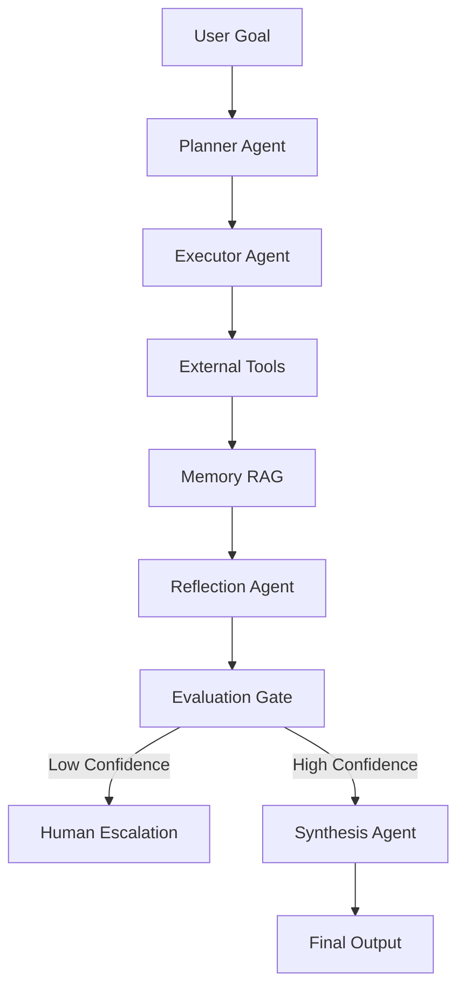

# Autonomous Cognitive Engine

An autonomous cognitive engine for deep research and long-horizon task execution.

**Deployed:** https://congnitive-agent.streamlit.app/

---

## Overview

The system simulates how AI agents plan tasks, use tools, maintain memory, evaluate confidence, and escalate to humans when needed.

### Core Capabilities

| Capability | Description |
|------------|-------------|
| Task Decomposition | Breaks goals into executable steps |
| Multi-Step Execution | Executes tasks sequentially |
| Tool Integration | Uses external tools with fallback logic |
| Vector Memory (RAG) | Stores and retrieves evidence |
| Self-Evaluation | Assesses confidence and evidence quality |
| Human Escalation | Escalates when confidence is low |

---

## Architecture


### Agents

- **Planner**: Decomposes goals into tasks
- **Executor**: Executes tasks using tools
- **Reflection**: Evaluates evidence quality
- **Evaluator**: Decides escalation vs. synthesis
- **Synthesis**: Produces grounded summaries

---

## Safety Controls

| Guardrail | Mechanism |
|-----------|-----------|
| Loop Prevention | Bounded execution steps |
| Hallucination Control | Reflection-based checks |
| Tool Failure Handling | Deterministic fallback |
| Confidence Management | Human escalation |

---

## Usage

### Local CLI
```bash
python src/main.py
```

### Streamlit UI
```bash
streamlit run app_streamlit.py
```

### Deployed UI
https://congnitive-agent.streamlit.app/

---

## Repository Structure
```
Intern_Submissions/Saurabh_Jha/
├── src/
├── app_streamlit.py
├── README.md
├── examples/
├── config/
└── docs/
```

---

## Status

✓ Implementation complete  
✓ Streamlit UI deployed  
✓ Core requirements satisfied